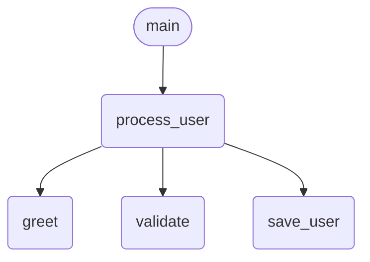
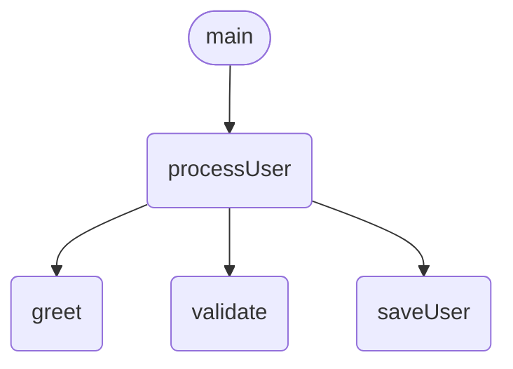
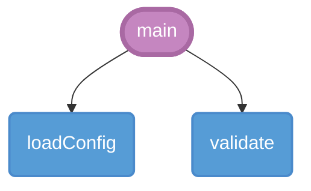
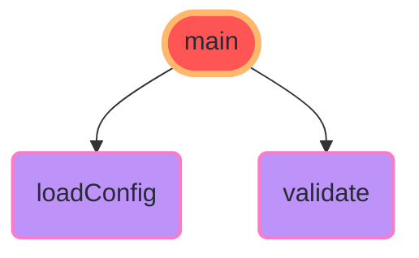
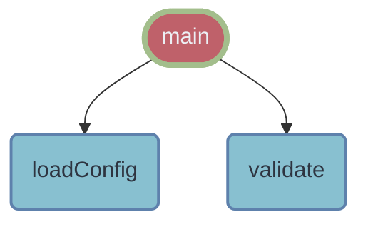

> **零安装、代码一键转 Mermaid 流程图。** `npx aicode2flow file.go` — 支持 8 种语言：Go / Python / JavaScript / TypeScript / Rust / Java / C / C++。
>
> [](README_EN.md) — [English README]

[](https://www.npmjs.com/package/aicode2flow)
[](https://opensource.org/licenses/MIT)
[](https://nodejs.org)

---

## 快速开始

```bash
# 单个文件
npx aicode2flow ./src/main.go

# 扫描整个项目
npx aicode2flow ./src/
```

把输出的 Mermaid 粘贴到 GitHub Markdown 的 ` ```mermaid ` 代码块中，GitHub 会自动渲染。

> 查看完整使用手册：[USAGE_CN.md](USAGE_CN.md)

---

## 效果展示

### Go

```go
func main() {
    processUser("Alice", "alice@test.com")
}
```

`npx aicode2flow main.go` 输出：


### Python

`npx aicode2flow app.py` 输出：



### JavaScript

`npx aicode2flow index.js` 输出：



---

### 🎯 自我分析

aicode2flow 甚至可以分析自己的源码结构！

```bash
npx aicode2flow ./src/ --theme github-dark
```

📊 **分析结果**: 39个函数，41条调用关系

```mermaid
%%init: {'theme':'dark', 'themeVariables': { 'primaryColor': '#569cd6', 'primaryTextColor': '#fff', 'primaryBorderColor': '#4a8acb', 'lineColor': '#808080', 'secondaryColor': '#4ec9b0', 'tertiaryColor': '#dcdcaa', 'background': '#1e1e1e', 'fontSize': '14px' }}
flowchart TD

  main([main])
  style main fill:#c586c0,stroke:#a969a3,stroke-width:4px,color:#fff
  _escapeReservedId_fn("_escapeReservedId")
  style _escapeReservedId_fn fill:#569cd6,stroke:#4a8acb,stroke-width:2px,color:#fff
  analyze("analyze")
  style analyze fill:#569cd6,stroke:#4a8acb,stroke-width:2px,color:#fff
  analyzeFile("analyzeFile")
  style analyzeFile fill:#569cd6,stroke:#4a8acb,stroke-width:2px,color:#fff
  applyThemeToMermaid("applyThemeToMermaid")
  style applyThemeToMermaid fill:#569cd6,stroke:#4a8acb,stroke-width:2px,color:#fff
  autoLoad("autoLoad")
  style autoLoad fill:#569cd6,stroke:#4a8acb,stroke-width:2px,color:#fff
  clearCache("clearCache")
  style clearCache fill:#569cd6,stroke:#4a8acb,stroke-width:2px,color:#fff
  constructor_fn("constructor")
  style constructor_fn fill:#569cd6,stroke:#4a8acb,stroke-width:2px,color:#fff
  createDefaultTheme("createDefaultTheme")
  style createDefaultTheme fill:#569cd6,stroke:#4a8acb,stroke-width:2px,color:#fff
  detect("detect")
  style detect fill:#569cd6,stroke:#4a8acb,stroke-width:2px,color:#fff
  escapeNodeId("escapeNodeId")
  style escapeNodeId fill:#569cd6,stroke:#4a8acb,stroke-width:2px,color:#fff
  findConfigDir("findConfigDir")
  style findConfigDir fill:#569cd6,stroke:#4a8acb,stroke-width:2px,color:#fff
  findQueriesDir("findQueriesDir")
  style findQueriesDir fill:#569cd6,stroke:#4a8acb,stroke-width:2px,color:#fff
  generateFlowchart("generateFlowchart")
  style generateFlowchart fill:#569cd6,stroke:#4a8acb,stroke-width:2px,color:#fff
  generateStyledFlowchart("generateStyledFlowchart")
  style generateStyledFlowchart fill:#569cd6,stroke:#4a8acb,stroke-width:2px,color:#fff
  generateThemedFlowchart("generateThemedFlowchart")
  style generateThemedFlowchart fill:#569cd6,stroke:#4a8acb,stroke-width:2px,color:#fff
  get_fn("get")
  style get_fn fill:#569cd6,stroke:#4a8acb,stroke-width:2px,color:#fff
  getShapeSyntax("getShapeSyntax")
  style getShapeSyntax fill:#569cd6,stroke:#4a8acb,stroke-width:2px,color:#fff
  getStats("getStats")
  style getStats fill:#569cd6,stroke:#4a8acb,stroke-width:2px,color:#fff
  has("has")
  style has fill:#569cd6,stroke:#4a8acb,stroke-width:2px,color:#fff
  inferNodeType("inferNodeType")
  style inferNodeType fill:#569cd6,stroke:#4a8acb,stroke-width:2px,color:#fff
  inferTypeFromSyntax("inferTypeFromSyntax")
  style inferTypeFromSyntax fill:#569cd6,stroke:#4a8acb,stroke-width:2px,color:#fff
  isValidStyleRule("isValidStyleRule")
  style isValidStyleRule fill:#569cd6,stroke:#4a8acb,stroke-width:2px,color:#fff
  languages("languages")
  style languages fill:#569cd6,stroke:#4a8acb,stroke-width:2px,color:#fff
  list("list")
  style list fill:#569cd6,stroke:#4a8acb,stroke-width:2px,color:#fff
  loadAll("loadAll")
  style loadAll fill:#569cd6,stroke:#4a8acb,stroke-width:2px,color:#fff
  loadFrom("loadFrom")
  style loadFrom fill:#569cd6,stroke:#4a8acb,stroke-width:2px,color:#fff
  loadGrammar("loadGrammar")
  style loadGrammar fill:#569cd6,stroke:#4a8acb,stroke-width:2px,color:#fff
  merge("merge")
  style merge fill:#569cd6,stroke:#4a8acb,stroke-width:2px,color:#fff
  mergeResults_fn("mergeResults")
  style mergeResults_fn fill:#569cd6,stroke:#4a8acb,stroke-width:2px,color:#fff
  names("names")
  style names fill:#569cd6,stroke:#4a8acb,stroke-width:2px,color:#fff
  parseNodeInfo("parseNodeInfo")
  style parseNodeInfo fill:#569cd6,stroke:#4a8acb,stroke-width:2px,color:#fff
  register("register")
  style register fill:#569cd6,stroke:#4a8acb,stroke-width:2px,color:#fff
  renderImage("renderImage")
  style renderImage fill:#569cd6,stroke:#4a8acb,stroke-width:2px,color:#fff
  resolve("resolve")
  style resolve fill:#569cd6,stroke:#4a8acb,stroke-width:2px,color:#fff
  sanitizeId_fn("sanitizeId")
  style sanitizeId_fn fill:#569cd6,stroke:#4a8acb,stroke-width:2px,color:#fff
  scanFiles_fn("scanFiles")
  style scanFiles_fn fill:#569cd6,stroke:#4a8acb,stroke-width:2px,color:#fff
  validateTheme("validateTheme")
  style validateTheme fill:#569cd6,stroke:#4a8acb,stroke-width:2px,color:#fff
  walk_fn("walk")
  style walk_fn fill:#569cd6,stroke:#4a8acb,stroke-width:2px,color:#fff

  main --> resolve
  main --> get_fn
  main --> languages
  main --> scanFiles_fn
  main --> analyzeFile
  main --> mergeResults_fn
  main --> detect
  main --> generateThemedFlowchart
  main --> generateFlowchart
  main --> renderImage
  main --> list
  walk_fn --> has
  walk_fn --> detect
  mergeResults_fn --> has
  mergeResults_fn --> get_fn
  mergeResults_fn --> _escapeReservedId_fn
  analyzeFile --> analyze
  loadGrammar --> has
  loadGrammar --> get_fn
  constructor_fn --> loadAll
  analyze --> loadGrammar
  analyze --> has
  analyze --> get_fn
  analyze --> sanitizeId_fn
  detect --> has
  detect --> get_fn
  generateFlowchart --> generateStyledFlowchart
  generateThemedFlowchart --> generateStyledFlowchart
  applyThemeToMermaid --> parseNodeInfo
  applyThemeToMermaid --> has
  escapeNodeId --> has
  escapeNodeId --> getShapeSyntax
  escapeNodeId --> inferNodeType
  parseNodeInfo --> inferTypeFromSyntax
  validateTheme --> isValidStyleRule
  loadFrom --> register
  autoLoad --> loadFrom
  resolve --> has
  resolve --> get_fn
  resolve --> merge
  getStats --> autoLoad
  linkStyle default stroke:#808080,stroke-width:2px,color:#d4d4d4
```



---

## 主题系统

aicode2flow 内置 **13 个精美主题**，让你的流程图更加专业。

### 快速使用

```bash
# 查看所有主题
aicode2flow --listThemes

# 使用主题
aicode2flow src.go --theme github-dark
aicode2flow src.py -o flow.md --theme dracula
```

### 主题预览

#### github-dark (推荐)
适合深色技术文档和开发者博客



#### dracula (流行)
流行的 Dracula 配色方案



#### nord (清新)
一眼心动的北极蓝调



### 更多主题

| 主题 | 适用场景 |
|------|----------|
| `github-dark` | 深色文档、开发者博客 |
| `github-light` | 浅色文档、打印 |
| `dracula` | 流行配色、现代文档 |
| `nord` | 清新冷淡风格 |
| `monokai` | 经典编辑器风格 |
| `high-contrast` | 无障碍访问 |
| `print-friendly` | 黑白打印 |

> 📖 查看完整主题指南：[USAGE.md](USAGE.md)

---

## 用法

```bash
# 基础用法 — 输出 Mermaid 到终端
npx aicode2flow ./src/main.go

# 扫描整个项目（自动识别所有支持的文件）
npx aicode2flow ./

# 扫描项目，只分析 Go 文件
npx aicode2flow ./ --language go

# 保存到文件
npx aicode2flow ./app.py -o flowchart.mmd

# 保存为 Markdown（带 ```mermaid 代码块）
npx aicode2flow ./index.js -o FLOWCHART.md

# 渲染为 SVG（需要 @mermaid-js/mermaid-cli）
npx aicode2flow ./main.go -o diagram.svg
npx aicode2flow ./app.py --format svg -o diagram.svg

# 渲染为 PNG
npx aicode2flow ./index.js --format png -o diagram.png

# 从左到右布局
npx aicode2flow ./main.go --direction LR

# 排除测试文件
npx aicode2flow ./ --exclude "_test|_spec"

# 强制指定语言
npx aicode2flow ./app.py -l go
```

### 参数说明

| 参数 | 别名 | 说明 | 默认值 |
|------|------|------|--------|
| `--output` | `-o` | 输出文件路径 (.mmd / .md / .svg / .png) | 终端输出 |
| `--format` | `-f` | 输出格式：mermaid / svg / png | mermaid |
| `--direction` | | 流程图方向：TD（从上到下）、LR（从左到右） | TD |
| `--language` | `-l` | 强制指定语言 (go/python/javascript) | 自动检测 |
| `--depth` | `-d` | 分析深度 | 0 |
| `--exclude` | `-e` | 排除模式 | — |
| `--ai` | | AI 语义增强（需要 API Key） | false |
| `--theme` | | Mermaid 主题 | default |
| `--version` | `-v` | 显示版本 | |
| `--help` | `-h` | 显示帮助 | |

---

## 支持的语言

| 语言 | 状态 | 扩展名 |
|------|------|--------|
| Go | ✅ 已完成 | `.go` |
| Python | ✅ 已完成 | `.py` |
| JavaScript | ✅ 已完成 | `.js`, `.jsx`, `.mjs`, `.cjs` |
| TypeScript | ✅ 已完成 | `.ts` |
| Rust | ✅ 已完成 | `.rs` |
| Java | ✅ 已完成 | `.java` |
| C | ✅ 已完成 | `.c`, `.h` |
| C++ | ✅ 已完成 | `.cpp`, `.cxx`, `.cc`, `.hpp`, `.hxx` |

> **添加新语言只需要两个文件**，不需要改源代码：
> 1. `config/languages/<name>.json` — 语言配置
> 2. `queries/<name>.scm` — Tree-sitter 查询模式

---

## 工作原理

```
源代码 → Tree-sitter AST → 配置驱动的查询引擎 → Mermaid 流程图
                                                       ↓ (可选)
                                                 AI 语义标签
```

架构采用**声明式、元编程**设计：
- **语言差异 = 数据**（JSON 配置 + SCM 查询），不是代码
- **单分析引擎**读取配置即可支持任意语言
- **输出 = 模板渲染**，无命令式图构建

---

## 竞品对比

| 特性 | aicode2flow | code2flow (PyPI) | js2flowchart |
|------|-------------|------------------|--------------|
| 零安装 (`npx`) | ✅ | ❌ `pip install` | ❌ `npm install` |
| 多语言 | ✅ Go/Python/JS | ✅ Python/JS | ❌ 仅 JS |
| Mermaid 输出 | ✅ GitHub 原生 | ❌ Graphviz | ❌ 仅 SVG |
| 输出到文件 | ✅ | ✅ | ❌ |
| AI 增强 | 🚧 | ❌ | ❌ |
| 持续维护 | ✅ 活跃 | ⚠️ 2023 年停更 | ⚠️ 2022 年停更 |

---

## 项目架构

```
config/languages/          ← JSON：语言定义（数据）
  go.json / python.json / javascript.json

queries/                   ← SCM：AST 查询模式（数据）
  go.scm / python.scm / javascript.scm

src/engine/
  registry.ts              — 读取 JSON 配置 → 语言注册表
  analyzer.ts              — 通用 Tree-sitter 查询引擎
  template.ts              — Mermaid 字符串构建器

src/cli.ts                 — CLI 入口
```

> 想加 Rust？`config/languages/rust.json` + `queries/rust.scm` 即可，**不需要改动一行 TypeScript**。

---

## 开发

```bash
git clone https://github.com/peterfei/aicode2flow.git
cd aicode2flow
npm install
npm run build
npm test
```

---

## 路线图

- [x] Go / Python / JavaScript 支持
- [x] TypeScript / Rust 支持
- [x] GitHub Action（PR 自动评论流程图）
- [x] SVG/PNG 输出
- [x] Java / C / C++ 支持
- [ ] 在线 Playground
- [ ] VSCode 插件

---

## 许可证

MIT
