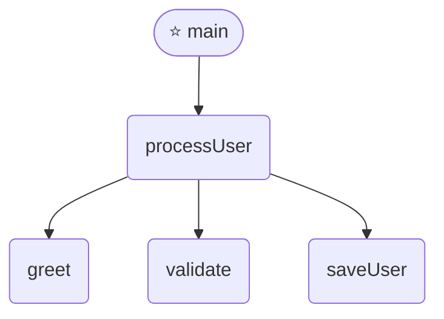

# aicode2flow

> **Zero-install code to Mermaid flowchart.** `npx aicode2flow file.go` — 代码一键生成流程图。

[](https://www.npmjs.com/package/aicode2flow)
[](https://opensource.org/licenses/MIT)
[](https://nodejs.org)

---

## Quick Start

```bash
# One command, zero setup
npx aicode2flow ./src/main.go
```

Paste the output into any GitHub Markdown file inside a ` ```mermaid ` block. GitHub renders it automatically.

---

## Examples

### Go

```go
func greet(name string) string {
    return "Hello, " + name
}

func processUser(name string, email string) {
    greeting := greet(name)
    if validate(email) {
        saveUser(name, email)
    }
}

func main() {
    processUser("Alice", "alice@test.com")
}
```

`npx aicode2flow main.go` outputs:


### Python

```python
def process_user(name, email):
    greeting = greet(name)
    if validate(email):
        save_user(name, email)

def main():
    process_user("Alice", "alice@test.com")
```

`npx aicode2flow app.py` outputs:


### JavaScript

```javascript
function main() {
    processUser("Alice", "alice@test.com");
}
```

`npx aicode2flow index.js` outputs:



---

## Usage

```bash
# Basic — output Mermaid to stdout
npx aicode2flow ./src/main.go

# Save to file
npx aicode2flow ./app.py -o flowchart.mmd

# Save as Markdown (with ```mermaid block)
npx aicode2flow ./index.js -o FLOWCHART.md

# Left-to-right layout
npx aicode2flow ./main.go --direction LR

# Force a specific language
npx aicode2flow ./app.py -l go
```

### Options

| Flag | Alias | Description | Default |
|------|-------|-------------|---------|
| `--output` | `-o` | Output file path (.mmd / .md) | stdout |
| `--direction` | | Flow direction: TD (top-down), LR (left-right) | TD |
| `--language` | `-l` | Force language (go/python/javascript) | auto-detect |
| `--depth` | `-d` | Analysis depth | 0 |
| `--exclude` | `-e` | Exclude pattern | — |
| `--ai` | | AI semantic enhancement (requires API key) | false |
| `--theme` | | Mermaid theme | default |
| `--version` | `-v` | Show version | |
| `--help` | | Show help | |

---

## Supported Languages

| Language | Status | Extensions |
|----------|--------|------------|
| Go | ✅ | `.go` |
| Python | ✅ | `.py` |
| JavaScript | ✅ | `.js`, `.jsx`, `.mjs`, `.cjs` |
| TypeScript | 🚧 Planned | |
| Rust | 🚧 Planned | |
| Java | 🚧 Planned | |

Adding a new language requires only two files — no code changes:
1. `config/languages/<name>.json` — language configuration
2. `queries/<name>.scm` — Tree-sitter query patterns

---

## How It Works

```
Source Code → Tree-sitter AST → Config-driven Query Engine → Mermaid Flowchart
                                                                   ↓ (optional)
                                                             AI Semantic Labels
```

The architecture follows a **declarative, metaprogramming** approach:
- **Language differences = data**, not code (JSON configs + SCM queries)
- **Single analysis engine** reads config to support any language
- **Output = template rendering**, not imperative graph building

---

## Comparison

| Feature | aicode2flow | code2flow (PyPI) | js2flowchart |
|---------|-------------|------------------|--------------|
| Zero install (`npx`) | ✅ | ❌ `pip install` | ❌ `npm install` |
| Multi-language | ✅ Go/Python/JS | ✅ Python/JS | ❌ JS only |
| Mermaid output | ✅ GitHub-native | ❌ Graphviz | ❌ SVG only |
| Output to file | ✅ | ✅ | ❌ |
| AI enhancement | 🚧 | ❌ | ❌ |
| Maintained | ✅ Active | ⚠️ Last update 2023 | ⚠️ Last update 2022 |

---

## Architecture

```
config/languages/          ← JSON: language definitions (data)
  go.json
  python.json
  javascript.json

queries/                   ← Tree-sitter SCM: AST patterns (data)
  go.scm
  python.scm
  javascript.scm

src/ engine/
  registry.ts              — Reads JSON configs → language registry
  analyzer.ts              — Generic Tree-sitter query engine
  template.ts              — Mermaid string builder

src/ cli.ts                — CLI entry point
```

Adding Rust? Create `config/languages/rust.json` + `queries/rust.scm` — **zero TypeScript changes**.

---

## Development

```bash
git clone https://github.com/peterfei/aicode2flow.git
cd aicode2flow
npm install
npm run build
npm test
```

---

## Roadmap

- [x] Go, Python, JavaScript support
- [ ] TypeScript, Rust support
- [ ] GitHub Action (auto-comment on PRs)
- [ ] SVG/PNG output
- [ ] Java support
- [ ] Online playground
- [ ] VSCode extension

---

## License

MIT
