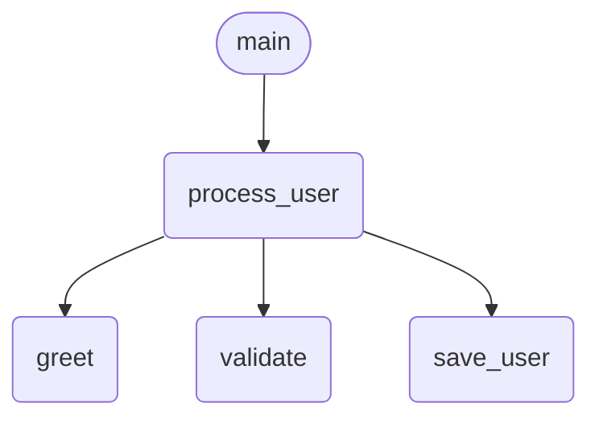
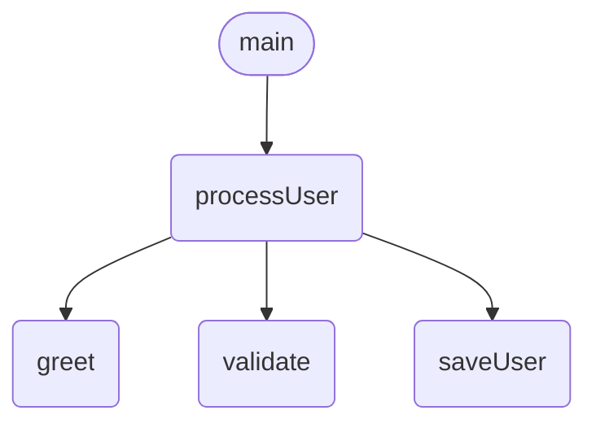
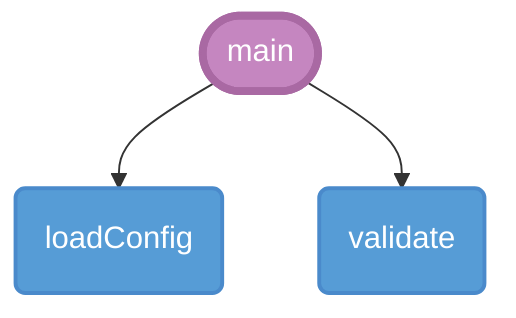
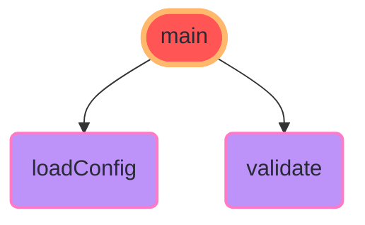
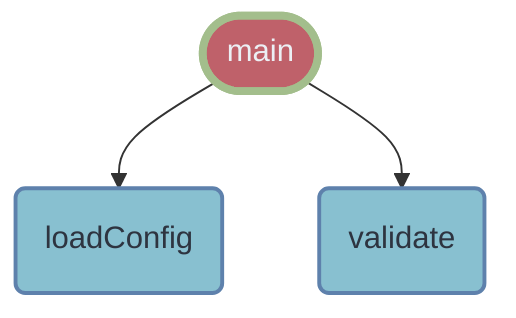

# aicode2flow

> **Zero-install code to Mermaid flowchart.** `npx aicode2flow file.go` — Generate flowcharts from code instantly.

[](https://www.npmjs.com/package/aicode2flow)
[](https://opensource.org/licenses/MIT)
[](https://nodejs.org)

---

## Quick Start

```bash
# Single file
npx aicode2flow ./src/main.go

# Scan entire project directory
npx aicode2flow ./src/
```

Paste the output into any GitHub Markdown file inside a ` ```mermaid ` block. GitHub renders it automatically.

> Full usage guide: [USAGE.md](USAGE.md)

---

## Examples

### Go

```go
func greet(name string) string {
    return "Hello, " + name
}

func processUser(name string, email string) {
    greeting := greet(name)
    if validate(email) {
        saveUser(name, email)
    }
}

func main() {
    processUser("Alice", "alice@test.com")
}
```

`npx aicode2flow main.go` outputs:


### Python

```python
def process_user(name, email):
    greeting = greet(name)
    if validate(email):
        save_user(name, email)

def main():
    process_user("Alice", "alice@test.com")
```

`npx aicode2flow app.py` outputs:



### JavaScript

```javascript
function main() {
    processUser("Alice", "alice@test.com");
}
```

`npx aicode2flow index.js` outputs:



---

### 🎯 Self Analysis

aicode2flow can even analyze its own source code structure!

```bash
npx aicode2flow ./src/ --theme github-dark
```

📊 **Analysis Result**: 39 functions, 41 call relationships

```mermaid
%%init: {'theme':'dark', 'themeVariables': { 'primaryColor': '#569cd6', 'primaryTextColor': '#fff', 'primaryBorderColor': '#4a8acb', 'lineColor': '#808080', 'secondaryColor': '#4ec9b0', 'tertiaryColor': '#dcdcaa', 'background': '#1e1e1e', 'fontSize': '14px' }}
flowchart TD

  main([main])
  style main fill:#c586c0,stroke:#a969a3,stroke-width:4px,color:#fff
  _escapeReservedId_fn("_escapeReservedId")
  style _escapeReservedId_fn fill:#569cd6,stroke:#4a8acb,stroke-width:2px,color:#fff
  analyze("analyze")
  style analyze fill:#569cd6,stroke:#4a8acb,stroke-width:2px,color:#fff
  analyzeFile("analyzeFile")
  style analyzeFile fill:#569cd6,stroke:#4a8acb,stroke-width:2px,color:#fff
  applyThemeToMermaid("applyThemeToMermaid")
  style applyThemeToMermaid fill:#569cd6,stroke:#4a8acb,stroke-width:2px,color:#fff
  autoLoad("autoLoad")
  style autoLoad fill:#569cd6,stroke:#4a8acb,stroke-width:2px,color:#fff
  clearCache("clearCache")
  style clearCache fill:#569cd6,stroke:#4a8acb,stroke-width:2px,color:#fff
  constructor_fn("constructor")
  style constructor_fn fill:#569cd6,stroke:#4a8acb,stroke-width:2px,color:#fff
  createDefaultTheme("createDefaultTheme")
  style createDefaultTheme fill:#569cd6,stroke:#4a8acb,stroke-width:2px,color:#fff
  detect("detect")
  style detect fill:#569cd6,stroke:#4a8acb,stroke-width:2px,color:#fff
  escapeNodeId("escapeNodeId")
  style escapeNodeId fill:#569cd6,stroke:#4a8acb,stroke-width:2px,color:#fff
  findConfigDir("findConfigDir")
  style findConfigDir fill:#569cd6,stroke:#4a8acb,stroke-width:2px,color:#fff
  findQueriesDir("findQueriesDir")
  style findQueriesDir fill:#569cd6,stroke:#4a8acb,stroke-width:2px,color:#fff
  generateFlowchart("generateFlowchart")
  style generateFlowchart fill:#569cd6,stroke:#4a8acb,stroke-width:2px,color:#fff
  generateStyledFlowchart("generateStyledFlowchart")
  style generateStyledFlowchart fill:#569cd6,stroke:#4a8acb,stroke-width:2px,color:#fff
  generateThemedFlowchart("generateThemedFlowchart")
  style generateThemedFlowchart fill:#569cd6,stroke:#4a8acb,stroke-width:2px,color:#fff
  get_fn("get")
  style get_fn fill:#569cd6,stroke:#4a8acb,stroke-width:2px,color:#fff
  getShapeSyntax("getShapeSyntax")
  style getShapeSyntax fill:#569cd6,stroke:#4a8acb,stroke-width:2px,color:#fff
  getStats("getStats")
  style getStats fill:#569cd6,stroke:#4a8acb,stroke-width:2px,color:#fff
  has("has")
  style has fill:#569cd6,stroke:#4a8acb,stroke-width:2px,color:#fff
  inferNodeType("inferNodeType")
  style inferNodeType fill:#569cd6,stroke:#4a8acb,stroke-width:2px,color:#fff
  inferTypeFromSyntax("inferTypeFromSyntax")
  style inferTypeFromSyntax fill:#569cd6,stroke:#4a8acb,stroke-width:2px,color:#fff
  isValidStyleRule("isValidStyleRule")
  style isValidStyleRule fill:#569cd6,stroke:#4a8acb,stroke-width:2px,color:#fff
  languages("languages")
  style languages fill:#569cd6,stroke:#4a8acb,stroke-width:2px,color:#fff
  list("list")
  style list fill:#569cd6,stroke:#4a8acb,stroke-width:2px,color:#fff
  loadAll("loadAll")
  style loadAll fill:#569cd6,stroke:#4a8acb,stroke-width:2px,color:#fff
  loadFrom("loadFrom")
  style loadFrom fill:#569cd6,stroke:#4a8acb,stroke-width:2px,color:#fff
  loadGrammar("loadGrammar")
  style loadGrammar fill:#569cd6,stroke:#4a8acb,stroke-width:2px,color:#fff
  merge("merge")
  style merge fill:#569cd6,stroke:#4a8acb,stroke-width:2px,color:#fff
  mergeResults_fn("mergeResults")
  style mergeResults_fn fill:#569cd6,stroke:#4a8acb,stroke-width:2px,color:#fff
  names("names")
  style names fill:#569cd6,stroke:#4a8acb,stroke-width:2px,color:#fff
  parseNodeInfo("parseNodeInfo")
  style parseNodeInfo fill:#569cd6,stroke:#4a8acb,stroke-width:2px,color:#fff
  register("register")
  style register fill:#569cd6,stroke:#4a8acb,stroke-width:2px,color:#fff
  renderImage("renderImage")
  style renderImage fill:#569cd6,stroke:#4a8acb,stroke-width:2px,color:#fff
  resolve("resolve")
  style resolve fill:#569cd6,stroke:#4a8acb,stroke-width:2px,color:#fff
  sanitizeId_fn("sanitizeId")
  style sanitizeId_fn fill:#569cd6,stroke:#4a8acb,stroke-width:2px,color:#fff
  scanFiles_fn("scanFiles")
  style scanFiles_fn fill:#569cd6,stroke:#4a8acb,stroke-width:2px,color:#fff
  validateTheme("validateTheme")
  style validateTheme fill:#569cd6,stroke:#4a8acb,stroke-width:2px,color:#fff
  walk_fn("walk")
  style walk_fn fill:#569cd6,stroke:#4a8acb,stroke-width:2px,color:#fff

  main --> resolve
  main --> get_fn
  main --> languages
  main --> scanFiles_fn
  main --> analyzeFile
  main --> mergeResults_fn
  main --> detect
  main --> generateThemedFlowchart
  main --> generateFlowchart
  main --> renderImage
  main --> list
  walk_fn --> has
  walk_fn --> detect
  mergeResults_fn --> has
  mergeResults_fn --> get_fn
  mergeResults_fn --> _escapeReservedId_fn
  analyzeFile --> analyze
  loadGrammar --> has
  loadGrammar --> get_fn
  constructor_fn --> loadAll
  analyze --> loadGrammar
  analyze --> has
  analyze --> get_fn
  analyze --> sanitizeId_fn
  detect --> has
  detect --> get_fn
  generateFlowchart --> generateStyledFlowchart
  generateThemedFlowchart --> generateStyledFlowchart
  applyThemeToMermaid --> parseNodeInfo
  applyThemeToMermaid --> has
  escapeNodeId --> has
  escapeNodeId --> getShapeSyntax
  escapeNodeId --> inferNodeType
  parseNodeInfo --> inferTypeFromSyntax
  validateTheme --> isValidStyleRule
  loadFrom --> register
  autoLoad --> loadFrom
  resolve --> has
  resolve --> get_fn
  resolve --> merge
  getStats --> autoLoad
  linkStyle default stroke:#808080,stroke-width:2px,color:#d4d4d4
```



---

## Theme System

aicode2flow comes with **13 beautiful built-in themes** to make your flowcharts more professional.

### Quick Start

```bash
# List all themes
aicode2flow --listThemes

# Use a theme
aicode2flow src.go --theme github-dark
aicode2flow src.py -o flow.md --theme dracula
```

### Theme Preview

#### github-dark (Recommended)
Perfect for dark technical documentation and developer blogs



#### dracula (Popular)
Popular Dracula color scheme



#### nord (Fresh)
Arctic blue color scheme



### More Themes

| Theme | Use Case |
|-------|----------|
| `github-dark` | Dark docs, developer blogs |
| `github-light` | Light docs, printing |
| `dracula` | Popular scheme, modern docs |
| `nord` | Clean, cool style |
| `monokai` | Classic editor style |
| `high-contrast` | Accessibility |
| `print-friendly` | B&W printing |

> 📖 See complete theme guide: [USAGE.md](USAGE.md)

---

## Usage

```bash
# Basic — output Mermaid to stdout
npx aicode2flow ./src/main.go

# Scan entire project (auto-detect all supported files)
npx aicode2flow ./

# Scan project, only analyze Go files
npx aicode2flow ./ --language go

# Save to file
npx aicode2flow ./app.py -o flowchart.mmd

# Save as Markdown (with ```mermaid block)
npx aicode2flow ./index.js -o FLOWCHART.md

# Render as SVG (requires @mermaid-js/mermaid-cli)
npx aicode2flow ./main.go -o diagram.svg
npx aicode2flow ./app.py --format svg -o diagram.svg

# Render as PNG
npx aicode2flow ./index.js --format png -o diagram.png

# Left-to-right layout
npx aicode2flow ./main.go --direction LR

# Exclude test files
npx aicode2flow ./ --exclude "_test|_spec"

# Force a specific language
npx aicode2flow ./app.py -l go
```

### Options

| Flag | Alias | Description | Default |
|------|-------|-------------|---------|
| `--output` | `-o` | Output file path (.mmd / .md / .svg / .png) | stdout |
| `--format` | `-f` | Output format: mermaid / svg / png | mermaid |
| `--direction` | | Flow direction: TD (top-down), LR (left-right) | TD |
| `--language` | `-l` | Force language (go/python/javascript) | auto-detect |
| `--depth` | `-d` | Analysis depth | 0 |
| `--exclude` | `-e` | Exclude pattern | — |
| `--ai` | | AI semantic enhancement (requires API key) | false |
| `--theme` | | Mermaid theme | default |
| `--version` | `-v` | Show version | |
| `--help` | | Show help | |

---

## Supported Languages

| Language | Status | Extensions |
|----------|--------|------------|
| Go | ✅ | `.go` |
| Python | ✅ | `.py` |
| JavaScript | ✅ | `.js`, `.jsx`, `.mjs`, `.cjs` |
| TypeScript | ✅ | `.ts` |
| Rust | ✅ | `.rs` |
| Java | ✅ | `.java` |
| C | ✅ | `.c`, `.h` |
| C++ | ✅ | `.cpp`, `.cxx`, `.cc`, `.hpp`, `.hxx` |

Adding a new language requires only two files — no code changes:
1. `config/languages/<name>.json` — language configuration
2. `queries/<name>.scm` — Tree-sitter query patterns

---

## How It Works

```
Source Code → Tree-sitter AST → Config-driven Query Engine → Mermaid Flowchart
                                                                   ↓ (optional)
                                                             AI Semantic Labels
```

The architecture follows a **declarative, metaprogramming** approach:
- **Language differences = data**, not code (JSON configs + SCM queries)
- **Single analysis engine** reads config to support any language
- **Output = template rendering**, not imperative graph building

---

## Comparison

| Feature | aicode2flow | code2flow (PyPI) | js2flowchart |
|---------|-------------|------------------|--------------|
| Zero install (`npx`) | ✅ | ❌ `pip install` | ❌ `npm install` |
| Multi-language | ✅ Go/Python/JS | ✅ Python/JS | ❌ JS only |
| Mermaid output | ✅ GitHub-native | ❌ Graphviz | ❌ SVG only |
| Output to file | ✅ | ✅ | ❌ |
| AI enhancement | 🚧 | ❌ | ❌ |
| Maintained | ✅ Active | ⚠️ Last update 2023 | ⚠️ Last update 2022 |

---

## Architecture

```
config/languages/          ← JSON: language definitions (data)
  go.json / python.json / javascript.json
  typescript.json / rust.json / java.json
  c.json / cpp.json

queries/                   ← Tree-sitter SCM: AST patterns (data)
  go.scm / python.scm / javascript.scm
  typescript.scm / rust.scm / java.scm
  c.scm / cpp.scm

src/engine/
  registry.ts              — Reads JSON configs → language registry
  analyzer.ts              — Generic Tree-sitter query engine
  template.ts              — Mermaid string builder

src/cli.ts                 — CLI entry point
```

Adding Rust? Create `config/languages/rust.json` + `queries/rust.scm` — **zero TypeScript changes**.

---

## Development

```bash
git clone https://github.com/peterfei/aicode2flow.git
cd aicode2flow
npm install
npm run build
npm test
```

---

## Roadmap

- [x] Go, Python, JavaScript support
- [x] TypeScript, Rust support
- [x] GitHub Action (auto-comment on PRs)
- [x] SVG/PNG output
- [x] Java, C, C++ support
- [ ] Online playground
- [ ] VSCode extension

---

## License

MIT
