# aicode2flow 主题系统完整使用指南

本文档展示所有13个预设主题的用法、效果和实际输出。

---

## 📋 目录

1. [快速开始](#快速开始)
2. [主题列表](#主题列表)
3. [主题详情](#主题详情)
   - [GitHub系列](#github系列)
   - [流行配色](#流行配色)
   - [编辑器主题](#编辑器主题)
   - [特殊用途](#特殊用途)
4. [主题对比](#主题对比)
5. [创建自定义主题](#创建自定义主题)

---

## 快速开始

### 列出所有主题

```bash
aicode2flow --listThemes
```

### 使用主题

```bash
# 基础用法
aicode2flow <源文件> --theme <主题名>

# 输出到文件
aicode2flow <源文件> -o <输出文件> --theme <主题名>

# 示例
aicode2flow src.go --theme github-dark
aicode2flow src.py -o flow.md --theme dracula
```

### 查看所有主题效果

本文档使用相同的示例代码展示所有主题效果：

**示例代码**: `examples/theme-demo.go`
```go
package main

func main() {
    config := loadConfig()
    validate(config)
    process(config)
}

func loadConfig() Config {
    return Config{Name: "demo", Limit: 100}
}

func validate(cfg Config) {
    if cfg.Name == "" {
        panic("empty name")
    }
}

func process(cfg Config) {
    for i := 0; i < cfg.Limit; i++ {
        item := createItem(i)
        transform(item)
        save(item)
    }
}
```

---

## 主题列表

| # | 主题名 | 描述 | 适用场景 |
|---|--------|------|----------|
| 1 | github-dark | GitHub Dark配色 | 深色技术文档、开发者博客 |
| 2 | github-light | GitHub Light配色 | 浅色文档、打印输出 |
| 3 | github-dim | 半透明Dark版本 | 复杂背景、叠加显示 |
| 4 | dracula | Dracula配色方案 | 流行配色、现代文档 |
| 5 | monokai | Monokai配色 | 经典编辑器风格 |
| 6 | nord | 北极蓝调配色 | 清新冷淡风格 |
| 7 | vscode-dark | VS Code Dark+配色 | 开发者友好 |
| 8 | modern | 现代扁平化设计 | 现代UI风格 |
| 9 | professional | 企业级配色 | 商务文档、技术报告 |
| 10 | pastel | 柔和粉彩配色 | 轻松文档、休闲风格 |
| 11 | high-contrast | 高对比度主题 | 无障碍访问、投影演示 |
| 12 | print-friendly | 打印友好主题 | 黑白打印、节省墨水 |
| 13 | dark | 深色主题 | 通用深色背景 |

---

## 主题详情

### GitHub系列

#### 1. github-dark

**描述**: 匹配GitHub Dark Mode的配色方案

**用法**:
```bash
aicode2flow src.go --theme github-dark
aicode2flow src.go -o flow.md --theme github-dark
```

**配色方案**:
- 背景: `#1e1e1e`
- 函数: `#569cd6` (VS Code蓝)
- 方法: `#4ec9b0` (青绿)
- 条件: `#dcdcaa` (黄)
- 循环: `#ce9178` (橙红)
- 入口: `#c586c0` (紫)

**适用场景**: 深色技术文档、开发者博客、GitHub README

**输出示例**:

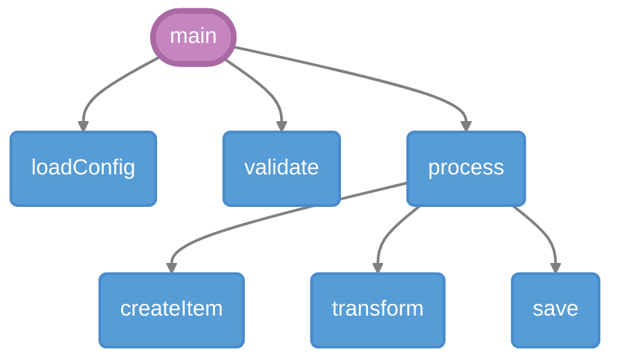

---

#### 2. github-light

**描述**: 匹配GitHub Light Mode的清新配色

**用法**:
```bash
aicode2flow src.go --theme github-light
```

**配色方案**:
- 背景: `#ffffff`
- 函数: `#0969da` (GitHub蓝)
- 方法: `#1a7f37` (绿)
- 条件: `#9a6700` (黄褐)
- 循环: `#8250df` (紫)
- 入口: `#cf222e` (红)

**适用场景**: 浅色文档、打印输出、正式报告

**输出示例**:

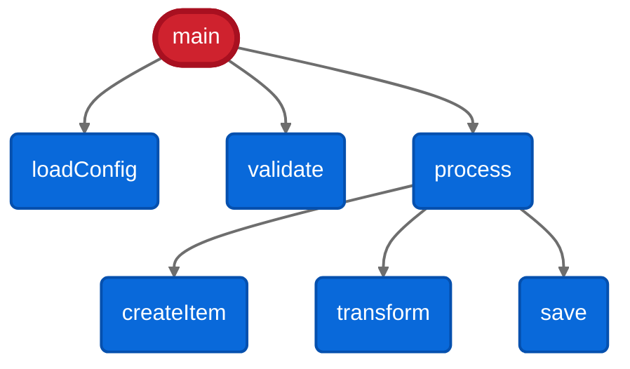

---

#### 3. github-dim (继承示例)

**描述**: GitHub Dark的半透明版本（继承github-dark）

**用法**:
```bash
aicode2flow src.go --theme github-dim
```

**特点**:
- 继承 `github-dark` 基础配色
- 添加 `opacity: 0.7` 半透明效果
- 虚线边框 (`stroke-dasharray: 5 5`)

**适用场景**: 复杂背景、叠加显示、水印效果

**输出示例**:

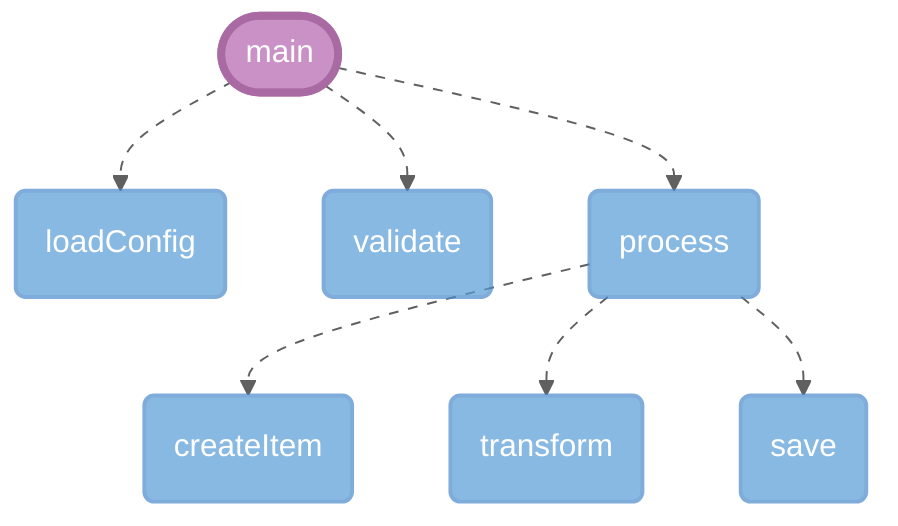

---

### 流行配色

#### 4. dracula

**描述**: 流行的Dracula配色方案

**用法**:
```bash
aicode2flow src.go --theme dracula
```

**配色方案**:
- 背景: `#282a36` (深紫)
- 函数: `#bd93f9` (紫)
- 方法: `#8be9fd` (青)
- 条件: `#ff79c6` (粉)
- 循环: `#ffb86c` (橙)
- 入口: `#ff5555` (红)

**适用场景**: 流行配色、现代文档、演示文稿

**官网**: https://draculatheme.com

**输出示例**:

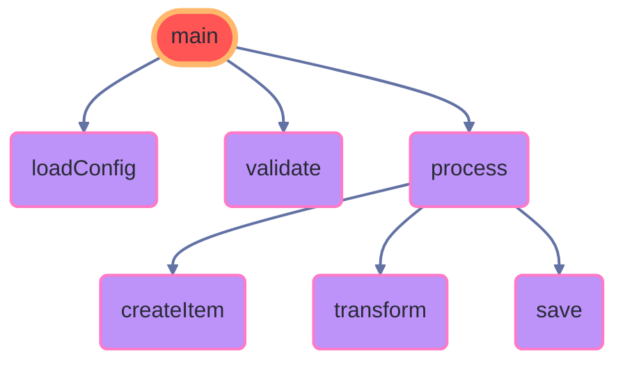

---

#### 5. monokai

**描述**: 经典Monokai编辑器配色

**用法**:
```bash
aicode2flow src.go --theme monokai
```

**配色方案**:
- 背景: `#272822` (深绿灰)
- 函数: `#66d9ef` (青)
- 方法: `#a6e22e` (绿)
- 条件: `#fd971f` (橙)
- 循环: `#f92672` (粉红)
- 入口: `#e6db74` (黄)

**适用场景**: 代码编辑器风格、复古主题

**输出示例**:

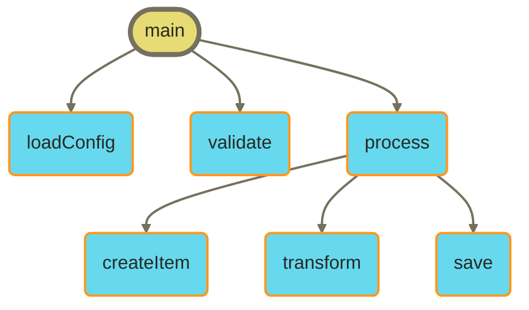

---

#### 6. nord

**描述**: 一眼心动的北极蓝调配色

**用法**:
```bash
aicode2flow src.go --theme nord
```

**配色方案**:
- 背景: `#2e3440` (北极夜)
- 函数: `#88c0d0` (冰蓝)
- 方法: `#a3be8c` (极光绿)
- 条件: `#ebcb8b` (雪顶黄)
- 循环: `#bf616a` (极光红)
- 入口: `#5e81ac` (深海蓝)

**适用场景**: 清新冷淡风格、Nordic设计

**官网**: https://www.nordtheme.com

**输出示例**:

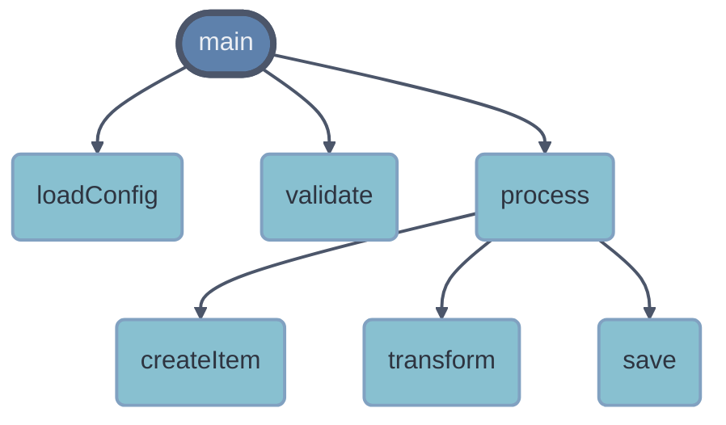

---

### 编辑器主题

#### 7. vscode-dark

**描述**: VS Code Dark+默认主题配色

**用法**:
```bash
aicode2flow src.go --theme vscode-dark
```

**配色方案**:
- 背景: `#1e1e1e` (VS Code深色)
- 函数: `#dcdcaa` (黄)
- 方法: `#569cd6` (蓝)
- 条件: `#c586c0` (紫)
- 循环: `#ce9178` (橙红)
- 入口: `#4ec9b0` (青绿)

**适用场景**: 开发者文档、技术博客、IDE集成

**输出示例**:

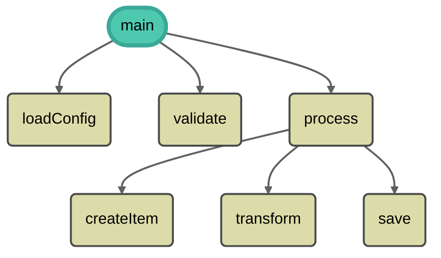

---

### 现代设计

#### 8. modern

**描述**: 现代扁平化设计

**用法**:
```bash
aicode2flow src.go --theme modern
```

**配色方案**:
- 扁平化设计
- 柔和色彩
- 现代UI风格

**适用场景**: 现代Web应用、UI文档

**输出示例**:


---

#### 9. professional

**描述**: 企业级专业配色

**用法**:
```bash
aicode2flow src.go --theme professional
```

**配色方案**:
- 企业级配色
- 适合商务文档
- 专业风格

**适用场景**: 商务文档、技术报告、企业文档

**输出示例**:

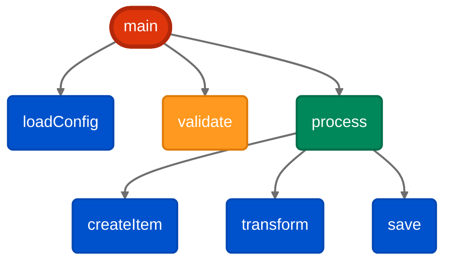

---

### 特殊用途

#### 10. pastel

**描述**: 柔和的粉彩配色

**用法**:
```bash
aicode2flow src.go --theme pastel
```

**配色方案**:
- 函数: `#a7c5eb` (粉蓝)
- 方法: `#b5d8b5` (粉绿)
- 条件: `#f7d794` (粉黄)
- 循环: `#f4a6a6` (粉红)
- 背景: `#fafbfc` (淡灰)

**适用场景**: 轻松文档、儿童教育、休闲风格

**输出示例**:

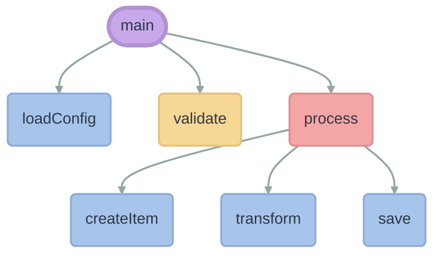

---

#### 11. high-contrast ♿ 无障碍

**描述**: 高对比度主题（WCAG AAA级别）

**用法**:
```bash
aicode2flow src.go --theme high-contrast
```

**配色方案**:
- 背景: `#000000` (纯黑)
- 文字: `#ffff00` (黄)
- 边框: `#ffffff` (纯白)
- 5px粗边框

**特点**: WCAG AAA级别对比度，无障碍友好

**适用场景**: 无障碍访问、投影演示、打印输出

**输出示例**:

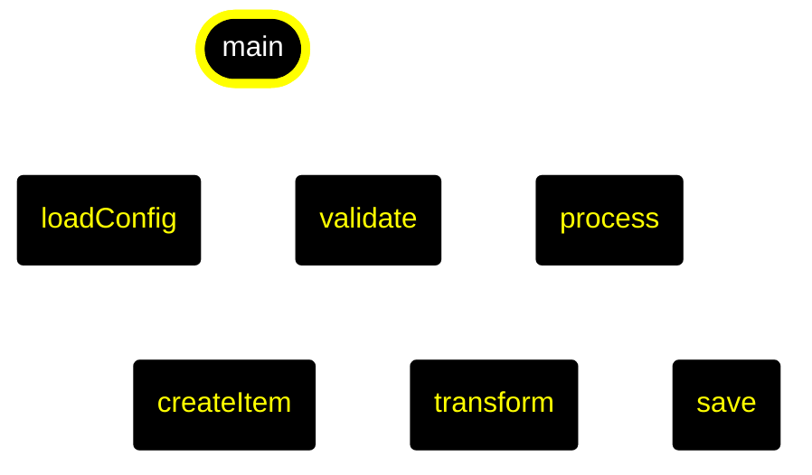

---

#### 12. print-friendly 🖨️ 打印

**描述**: 打印友好主题（节省墨水）

**用法**:
```bash
aicode2flow src.go --theme print-friendly
```

**配色方案**:
- 背景: `#ffffff` (纯白)
- 元素: `#000000` (纯黑) + 灰度
- 细线条 (1.5px)

**特点**: 黑白灰配色，无彩色墨水

**适用场景**: 黑白打印、节省成本、文档归档

**输出示例**:

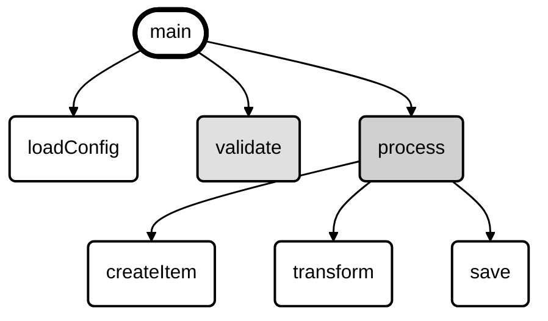

---

#### 13. dark

**描述**: 通用深色主题

**用法**:
```bash
aicode2flow src.go --theme dark
```

**配色方案**:
- 基础深色配色
- 适合多种场景

**适用场景**: 通用深色背景

**输出示例**:

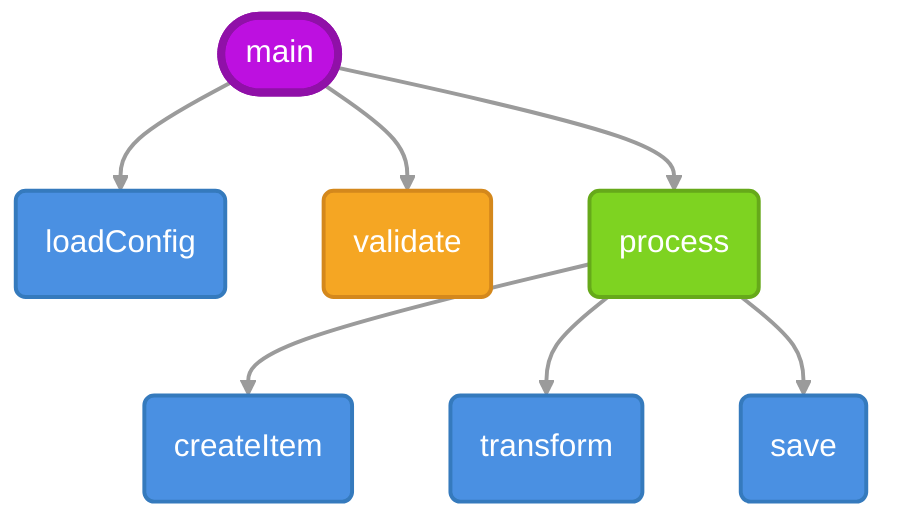

---

## 主题对比

### 按背景色分类

#### 深色主题
- github-dark
- github-dim
- dracula
- monokai
- nord
- vscode-dark
- dark

#### 浅色主题
- github-light
- modern
- professional
- pastel

#### 特殊用途
- high-contrast (黑白高对比)
- print-friendly (黑白灰)

### 按用途分类

| 用途 | 推荐主题 |
|------|----------|
| **开发者文档** | github-dark, vscode-dark, dracula |
| **技术博客** | github-dark, nord, monokai |
| **商务文档** | professional, github-light |
| **演示文稿** | high-contrast, dracula, pastel |
| **打印输出** | print-friendly, github-light |
| **无障碍** | high-contrast |
| **轻松风格** | pastel, modern |

---

## 创建自定义主题

### 方法1: 使用模板

```bash
# 复制模板
cp config/themes/theme-template.json config/themes/my-theme.json

# 编辑主题
vim config/themes/my-theme.json

# 使用主题
aicode2flow src.go --theme my-theme
```

### 方法2: 继承现有主题

```json
{
  "name": "my-theme",
  "extends": "github-dark",

  "styles": {
    "function": "fill:#569cd6,stroke:#4a8acb,color:#fff,opacity:0.8"
  }
}
```

### 方法3: 从零创建

```json
{
  "name": "my-custom-theme",
  "meta": {
    "description": "我的自定义主题",
    "author": "Your Name"
  },
  "styles": {
    "function": "fill:#4a90e2,stroke:#357abd,stroke-width:2px,color:#fff",
    "condition": "fill:#f5a623,stroke:#d4881c,stroke-width:2px,color:#fff",
    "entry": "fill:#bd10e0,stroke:#9010a8,stroke-width:4px,color:#fff"
  },
  "links": {
    "default": "stroke:#9b9b9b,stroke-width:2px,color:#666666"
  }
}
```

---

## 主题速查表

| 命令 | 效果 |
|------|------|
| `aicode2flow src.go --theme github-dark` | GitHub深色主题 |
| `aicode2flow src.go --theme dracula` | Dracula流行配色 |
| `aicode2flow src.go --theme nord` | 北极蓝调 |
| `aicode2flow src.go --theme high-contrast` | 高对比度 |
| `aicode2flow src.go --theme print-friendly` | 打印友好 |
| `aicode2flow --listThemes` | 列出所有主题 |

---

## 最佳实践

### 选择主题的建议

1. **技术文档**
   - 首选: `github-dark`, `vscode-dark`
   - 原因: 开发者熟悉，配色专业

2. **演示文稿**
   - 首选: `high-contrast`, `dracula`
   - 原因: 投影可读性好，视觉冲击强

3. **打印文档**
   - 首选: `print-friendly`, `github-light`
   - 原因: 节省墨水，打印清晰

4. **休闲阅读**
   - 首选: `pastel`, `nord`
   - 原因: 色彩柔和，视觉舒适

5. **商务文档**
   - 首选: `professional`, `github-light`
   - 原因: 配色稳重，适合正式场合

---

## 输出格式

### Markdown (推荐)

```bash
aicode2flow src.go -o flow.md --theme github-dark
```

输出: 包含 ```mermaid 代码块的Markdown

### 纯Mermaid

```bash
aicode2flow src.go -o flow.mmd --theme github-dark
```

输出: 纯Mermaid代码

### SVG

```bash
aicode2flow src.go -o flow.svg --theme github-dark
```

输出: 渲染的SVG图片

---

## 常见问题

### Q: 如何在GitHub中渲染？

A: 将Markdown输出推送到GitHub，GitHub会自动渲染 ```mermaid 代码块。

### Q: 如何本地预览？

A: 访问 https://mermaid.live 粘贴Mermaid代码预览。

### Q: 主题未生效怎么办？

A: 检查：
```bash
# 确认主题存在
aicode2flow --listThemes

# 查看详细输出
aicode2flow src.go --theme github-dark
```

---

## 相关资源

- [主题创建指南](./THEME_GUIDE.md)
- [主题测试指南](./TESTING_GUIDE.md)
- [主题展示](./THEME_SHOWCASE.md)
- [Mermaid官方文档](https://mermaid.js.org/)

---

## 更新日志

### v1.0.0 (2025-01-08)

- ✅ 初始主题系统
- ✅ 13个预设主题
- ✅ 主题继承支持
- ✅ 零依赖实现

---

**享受使用aicode2flow主题系统！** 🎨
